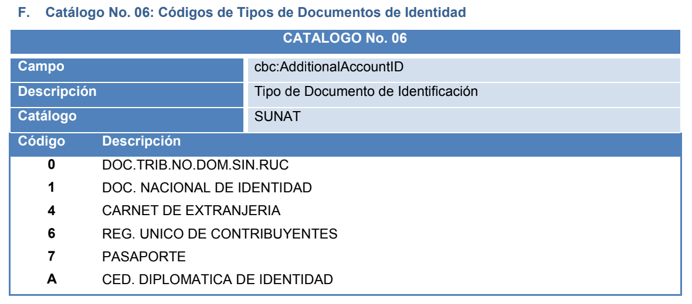

### Customer
Son datos del cliente, dependiendo si es Jurídico o Natural

Nombre | Formato | Tipo | Obligatorio | Descripcion 
------------ | ------------- | ------------- | ------------- | -------------
document | XXXXXXXX, XXXXXXXXXXX | String | Si | Número de documento del cliente. Es obligatorio si es una factura o cuando sobre pasa los S/ 700.00 en una boleta, Para los otros casos es '-'
client_id | any| String | Si | Id en tu sistema
type_document | any| String | Si | **Código de la Sunat** para el tipo de documentos de identidad
business_name | any| String | No | Razón social o nombre del cliente. Es obligatorio si es una factura o cuando sobre pasa los S/ 700.00 en una boleta, Para los otros casos es '-'
telephone | any| String | No | El número de teléfono del cliente
email | any| String | No | El el email del cliente
address | any| String | Si | Es obligatorio si es una factura

#### CÓDIGOS SUNAT

* Tipo documento

